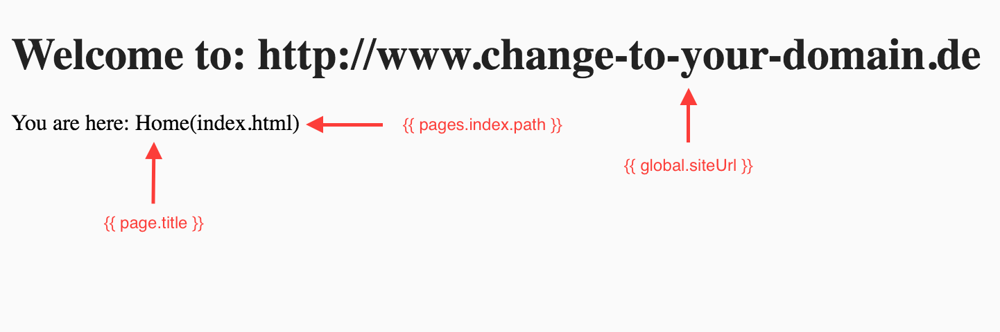

# Yet another front-end build process #

Version: 1.2.1

Simple but powerful static site generator, starter or boilerplate.

Impression:



## Features ##

* Templating (Layouts, blocks, includes, macros, more)
* Template data layer (Access data in template or via ajax: global, per page, from all pages)
* Template helpers(moment.js, accounting.js)
* Modular less-stylesheets (Hot-reloading)(Autoprefixed)(Sourcemaps)
* Modular javascript (Sourcemaps)
* Auto image-optimization
* Sitemap-generator
* Autoreload
* Tunnel(expose localhost to public URL)
* Proxy
* PageSpeed Insights reporting


## Installation ##

If you have not already installed nodejs and npm: [https://nodejs.org/](https://nodejs.org/ "https://nodejs.org/")

If you have not already installed git: [https://git-scm.com](https://git-scm.com/book/en/v2/Getting-Started-Installing-Git "https://git-scm.com/book/en/v2/Getting-Started-Installing-Git") (Optional)

Install gulp-cli via Terminal.

```
npm install --g gulp-cli
```


## Setup ##

Clone this repository via Terminal. Or just click on the download-button in the right corner...

```
git clone https://github.com/koljakutschera/yafbp && cd yafbp
```

Install dependencies via Terminal(Maybe sudo is needed).

```
npm install
```


## Configuration ##

You can configure the process-settings in /gulpfile.js:

Example: Default configuration

```javascript
var config = {
	source_dir : './source/',
	build_dir : './build/',
	statics_dir : 'statics/',
	templates_dir : 'templates/',
	data_dir : 'data/',
	styles_dir : 'styles/',
	scripts_dir : 'scripts/',
	images_dir : 'images/',
	connect_port : 8080,
	proxy_port : 9090,
	proxyAuth : '',
	autoprefix : ["> 1%","last 4 versions"]
}
```


## Usage ##

In the project-directory start the development process via Terminal:

```
gulp
```

Or with minification for styles, scripts, images and html.

```
gulp --production
```

Or with exposing localhost to public URL(See public development covered in the next section)

```
gulp --tunnel
```

Or with [PageSpeed-Insights](https://developers.google.com/speed/pagespeed/insights/) reports for all pages(could take a few minutes...)

```
gulp --production --tunnel --psi
```


## Development ##

### Local development ###

When the process is running open the following url in your browser:

```
http://localhost:8080
```

### Public development ###

When using --tunnel flag you can also access your project via temporary public URL.
With this you can for example check your site with [browserstack](https://www.browserstack.com/) or send the link to your customer for live-testing.

> Hint: On every process start you get a new temporary public URL. You can see it in terminal logs.

Example: See terminal logs for public URL
```
Exposing localhost:8080 via public URL: https://temorary123.eu.ngrok.io
```


## Templating ##

In **source/templates** [Nunjucks](https://mozilla.github.io/nunjucks/templating.html "Nunjucks") is used for templating with all its features like block inheritance(layouts), autoescaping, macros and more.
Every(except for files starting with an _) .html file on the root-level of the directory is compiled to the build/ directory. Templates on the root-level are your "pages".
Files in sub-directories are ignored, but can be included in root-templates via Nunjucks [template-inheritance-system](https://mozilla.github.io/nunjucks/templating.html#template-inheritance "Nunjucks template-inheritance"). 

> Info: The default directory structure is only a recommendation - feel free to delete everything and start from scratch.

> Hint: Files starting with an _ will not compile. Use this for drafts etc.

Example: Simple layout

```html
<!DOCTYPE html>
<html>
	<head>
		<meta charset="utf-8"/>
		<title>{{ page.title }}</title>
		
		
		<link rel="stylesheet" href="styles/core.css">
		
		
	</head>
	<body>
		
		
		<script type="text/javascript" src="scripts/core.js"></script>
		
		
	</body>
</html> 
```

Example: Simple page

```html
---
title: Home
---




<meta name="description" content="This is home.">



<link rel="stylesheet" href="styles/home.css">



<h1>Welcome to: {{ global.siteUrl }}</h1>
<p>You are here: {{ page.title }}({{pages.index.path}})</p>



<script type="text/javascript" src="scripts/home.js"></script>

```

Result:

```html
<!DOCTYPE html>
<html>
    <head>
        <meta charset="utf-8"/>
        <title>Home</title>
        <meta name="description" content="This is home.">
        <link rel="stylesheet" href="styles/core.css">
        <link rel="stylesheet" href="styles/home.css">
    </head>
    <body>
        <h1>Welcome to: http://www.change-to-your-domain.de</h1>
        <p>You are here: Home(index.html)</p>
        <script type="text/javascript" src="scripts/core.js"></script>
        <script type="text/javascript" src="scripts/home.js"></script>
    </body>
</html> 
```

See [https://mozilla.github.io/nunjucks/](https://mozilla.github.io/nunjucks/) for more.

### Template helpers ###

You can use the following included helpers in your nunjucks templates and macros:
* [moment.js](http://momentjs.com/) - Parse, validate, manipulate, and display dates.
* [accounting.js](http://openexchangerates.github.io/accounting.js/) - number, money and currency formatting

> Hint: You can add your own helpers to the global data object covered in the next section.


Example: Formating a date-string with moment.js 

```html
<span>{{moment("2017-09-20").locale('de').format('LL')}}</span>
```

Result: Showing formatted German date

```html
<span>20. September 2017</span>
```


Example: Formating money with accounting.js

```html
<span>{{ accounting.formatMoney(4999.99, "€", 2, ".", ",") }}</span>
```

Result: Showing formatted money

```html
<span>€4.999,99</span>
```


## Template data layer ##

### Global data ###

In **data/index.js** you can define your own data-sets and export it to all your templates.
Think about generating navigation from json or exposing data from a csv-files that is read via nodejs.
Global data is accessible in templates via "global" variable.
The data is also written to build/data.json for ajax-access.

> Info: The default directory structure in data/ is only a recommendation - feel free to delete everything except for data/index.js and start from scratch.

> Help: There is a helper-function in data/index.js to import node-modules un-cached. Use this if you always want fresh data on every file-change.

> Hint: You can dump the global data with: {{ global | dump }}

Example: Export site-url to all templates.

```javascript
var global = {
    siteUrl : 'http://www.change-to-yourdomain.de' // Required for sitemap.xml - do not delete!
};

// Expose data to templates
module.exports = global;
```

Example: Access site-url in page:

```html
<h1>Welcome to: {{ global.siteUrl }}</h1>
```

Result:

```html
<h1>Welcome to: http://www.change-to-yourdomain.de</h1>
```


### Per page data ###

You can also provide data directly to a page via **YAML-Front-Matter** at the top of root-templates.
This data is accessible in the template via "page" variable.

> Hint: You can dump the data of a page with: {{ page | dump }} 

Example: YAML-Front-Matter at the top of a page:

```
---
title: Home
---
```

Example: Access YAML-Front-Matter from page in layout template:

```html
<title>{{ page.title }}</title>
```

Result:

```html
<title>Home</title>
```


### All pages data ###

All the data you have provided to all root-templates via YAML-Front-Matter is also accessible in all other templates via "pages"-variable.
The data is also written to build/data.json for ajax-access.
You can access data from another page by the name of the template without the .html extension.

> Info: This gives you almost all possibilities you want from a static-page-generator.

> Hint: You can dump the data of all pages with: {{ pages | dump }} 

Example: Access data of another page in a page:

```html
<h1>Every little page knows the path of the index-page: {{ pages.index.path }}</h1>
```

Result:

```html
<h1>Every little page knows the title of the index-page: index.html</h1>
```


## Sitemap-generator ##

For our SEOs all .html files on the root-level of **source/templates** are indexed to the sitemap.xml-file in the build/ directory. Files starting with an _ are excluded.


## Modular less-stylesheets ##

In **source/styles** every(except for files starting with an _) .less file on the root-level of the directory is compiled to the build/styles/ directory.
Files in sub-directories are ignored, but can be imported in root-stylesheets via less-imports.

For example and depending on your needs you can use one core.less file and import all stylesheets in it for single-page-apps. Or you can use the core.less file for shared styles and multiple other files for per-page styles in a multi-page setup.

> Hot: Styles are hot-reloaded(See file-changes without reloading the browser);

> Info: The default directory structure is only a recommendation - feel free to delete everything and start from scratch.

> Hint: You can also pass options to less-imports. [http://lesscss.org/](http://lesscss.org/features/#import-options "import-options")

Example: Importing another stylesheet.

```less
@import "tools/reset.less";
```

See [http://lesscss.org/](http://lesscss.org/) for more.


## CSS-Autoprefixer ##

When writing less/css browser-prefixes are automatically added. You can configure browser-versions in /gulpfile.js


## Modular javascript ##

In **source/scripts** every(except for files starting with an _) .js-file on the root-level of the directory is compiled to the build/scripts/ directory.
Files in sub-directories are ignored, but can be included in root-scripts via a special comment/directive.

Depending on your needs you can use one core.js file and require all libs and scripts in it for single-page-apps. Or you can use the core.js file for shared libraries and multiple other files for per-page scripts in a multi-page setup.

> Info: The default directory structure is only a recommendation - feel free to delete everything and start from scratch.

> Hint: Script including works recursively (files can include files that can include files, and so on)

Example: Importing another script.

```javascript
//=require tools/log.js
```

See [https://www.npmjs.com/package/gulp-include](https://www.npmjs.com/package/gulp-include) for more.

## Auto image-optimization ##

In **source/images** every .jpg, .png, .gif and .svg file is compiled/optimized to the build/images/ directory.

> The default directory structure is only a recommendation - feel free to delete everything and start from scratch.


## Static Files ##

In **source/statics** you can put fonts, media etc. Every file and directory is copied to the build/statics/ directory.


## Proxy ##

The proxy is listening on port: 9090. Use it for example if you cant access an api-endpoint via ajax because of Cross-Origin Resource Sharing (CORS).

> Hint: You can add http-authentication to the proxy in /gulpfile.js

Example: Proxy usage with jQuery:

```javascript
var proxy = 'http://localhost:9090/';
var endpoint = 'www.echojs.com/'; // change this to your api-endpoint.

$.getJSON(proxy + endpoint, function( data ) {
    console.log(data)
});
```

## Auto-reload ##

When the build process is started a file-watcher watches for file-changes and auto-reloads the browser every time you change a file. Sometimes on first start you have to do a manual reload because the process is faster than the browser.


## Where do I start? ##

Just look at the contents of the source/ directory.
There are just a few example files that should be self-documenting.

If you want a more advanced example checkout: [yafbp-example-blog](https://github.com/koljakutschera/yafbp-example-blog)

To start from scratch -  You can delete everything in source/images/, source/scripts/, source/styles/, source/templates/ directories. In the data/ directory only /index.js is required.
For scripts and styles remember that files on the root-level act as entry-points.

Feel free to configure anything in /gulpfile.js to your needs.

## Contribution ##

Please don't! Except for bugs. Iam not interested in extending this project with more crazy stuff to increase its complexity. 
If you want babel, react or your shiny whatever JS-Framework just fork this repo and put it in the source directory :P


## Thank you ##

Thank you to all funky developers listed in /package.json.


## History ##

* V1.2.1: Configuration added. See readme.md -> Configuration
* V1.2.0: Added PageSpeed Insights reporting feature. See readme.md -> Usage
* V1.1.0: Added Tunnel(expose localhost to public URL) feature. See readme.md
* V1.0.2: Global- and pages data objects are now nunjucks-globals so that they can be used in macros too. Cache optimized.
* V1.0.1: Added Template helpers(moment.js, accounting.js). See readme.md
* V1.0.0: Dropped SVGInjector for simplicity, Data-layer extended with global, page, pages variables, Added sitemap-generator, Simplify examples, Using _ in filenames for drafts, removed build/ from .gitignore


## Troubleshooting ##

Linux: The system has a limit to how many files can be watched by a user. The following command increases the maximum amount of watches a user can have:

```
echo fs.inotify.max_user_watches=524288 | sudo tee -a /etc/sysctl.conf && sudo sysctl -p
```

## Licence ##

The MIT License (MIT)

Copyright (c) 2016 [Kolja Kutschera](http://koljakutschera.de/ "Kolja Kutschera")

Permission is hereby granted, free of charge, to any person obtaining a copy
of this software and associated documentation files (the "Software"), to deal
in the Software without restriction, including without limitation the rights
to use, copy, modify, merge, publish, distribute, sublicense, and/or sell
copies of the Software, and to permit persons to whom the Software is
furnished to do so, subject to the following conditions:

The above copyright notice and this permission notice shall be included in
all copies or substantial portions of the Software.

THE SOFTWARE IS PROVIDED "AS IS", WITHOUT WARRANTY OF ANY KIND, EXPRESS OR
IMPLIED, INCLUDING BUT NOT LIMITED TO THE WARRANTIES OF MERCHANTABILITY,
FITNESS FOR A PARTICULAR PURPOSE AND NONINFRINGEMENT. IN NO EVENT SHALL THE
AUTHORS OR COPYRIGHT HOLDERS BE LIABLE FOR ANY CLAIM, DAMAGES OR OTHER
LIABILITY, WHETHER IN AN ACTION OF CONTRACT, TORT OR OTHERWISE, ARISING FROM,
OUT OF OR IN CONNECTION WITH THE SOFTWARE OR THE USE OR OTHER DEALINGS IN
THE SOFTWARE.
